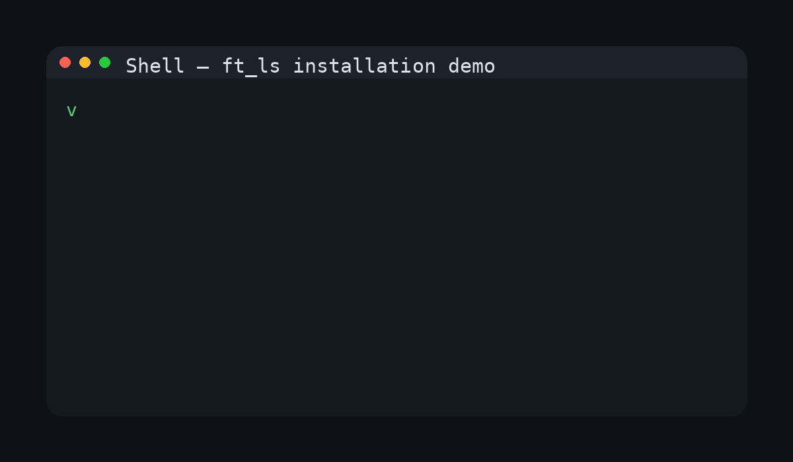

# ft_ls 🖥️

[](https://en.wikipedia.org/wiki/C_(programming_language))
[](https://en.wikipedia.org/wiki/Unix)
[](https://www.42.fr/)
[](LICENSE)

> A 42 school project: Recreating the Unix `ls` command in C.

---

## 📌 Description

`ft_ls` is a C project that replicates the Unix `ls` command. It provides an in-depth exploration of filesystem handling, directory traversal, and file metadata using low-level system calls.

This project allows you to:

- Explore Unix file system structures.
- Retrieve and display file and directory metadata.
- Practice memory-safe, modular C programming.
- Understand sorting and formatting of terminal output.

---

## 🎬 Demo

<p align="center">
  
</p>

---

## 🌐 Architecture Overview

```text
+----------------------+
|      User Input      |
|   (./ft_ls flags)    |
+----------+-----------+
           |
           v
+----------------------+
|   Argument Parsing   |
+----------+-----------+
           |
           v
+----------------------+
| Directory Traversal  |
| (opendir/readdir)    |
+----------+-----------+
           |
           v
+----------------------+
|   File Information   |
|   (stat, lstat...)   |
+----------+-----------+
           |
           v
+----------------------+
|   Sorting & Output   |
+----------------------+
```

Flow summary:
1. Parse user input and flags.
2. Traverse directories using system calls.
3. Retrieve file metadata (size, permissions, timestamps, owner, etc.).
4. Sort and display output according to flags.

---

## 💡 Features

### Mandatory Part

- Reimplementation of `ls` command  
- Support multiple directories  
- File and directory listing with metadata  
- Sorting by name, time, or reverse order  
- Recursive listing (`-R`)  
- Long format (`-l`) with permissions, owner, size, timestamps  
- Display hidden files (`-a`)  
- Robust error handling  
- Memory-safe (no leaks)

**Supported flags:**

| Flag | Description |
|------|-------------|
| `-l` | Long listing format |
| `-R` | Recursive directory listing |
| `-a` | Show hidden files |
| `-r` | Reverse sorting order |
| `-t` | Sort by modification time |

---

## 🖥️ Usage Examples

**Basic:**
```bash
./ft_ls
```

**With flags:**
```bash
./ft_ls -l
./ft_ls -la
./ft_ls -lR
```

**Multiple directories:**
```bash
./ft_ls dir1 dir2
```

---

## ⚙️ Installation & Compilation

### Requirements
- Unix-based OS (Linux/macOS)  
- GCC or Clang  
- `make` utility

### Clone & Build
```bash
git clone <repository_url>
cd ft_ls
make
```

Compilation flags:
```bash
-Wall -Wextra -Werror
```

### Run
```bash
./ft_ls [options] [files/directories]
```

---

## 🔍 Allowed Functions

- Directory: `opendir`, `readdir`, `closedir`  
- File info: `stat`, `lstat`, `readlink`  
- User/group: `getpwuid`, `getgrgid`  
- Attributes: `listxattr`, `getxattr`  
- Time: `time`, `ctime`  
- Memory: `malloc`, `free`  
- Output & errors: `write`, `perror`, `strerror`, `exit`

---

## 📚 Learning Outcomes

- Programmatic directory navigation  
- Retrieval and interpretation of file metadata  
- Understanding Unix file system internals  
- Designing modular, maintainable C programs  
- Importance of memory management and error handling

---

## 🤝 Contributing

1. Fork the repository  
2. Create a new branch (`git checkout -b feature/your-feature`)  
3. Make your changes  
4. Commit (`git commit -m 'Add feature'`)  
5. Push (`git push origin feature/your-feature`)  
6. Open a Pull Request

---

## 📜 License

This project is licensed under the MIT License - see the [LICENSE](LICENSE) file for details.

---

### 🤖 AI Assistance

AI was used for:
- Structuring README  
- Explaining system call behavior  
- Suggesting best practices in C  

No AI was used for actual code implementation.

